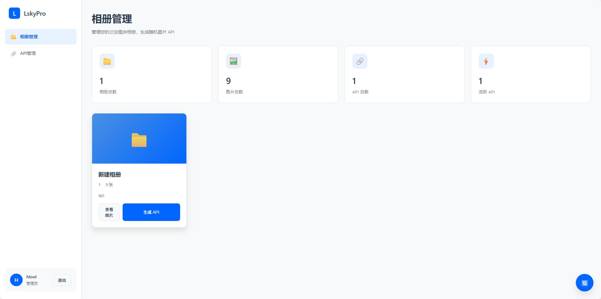
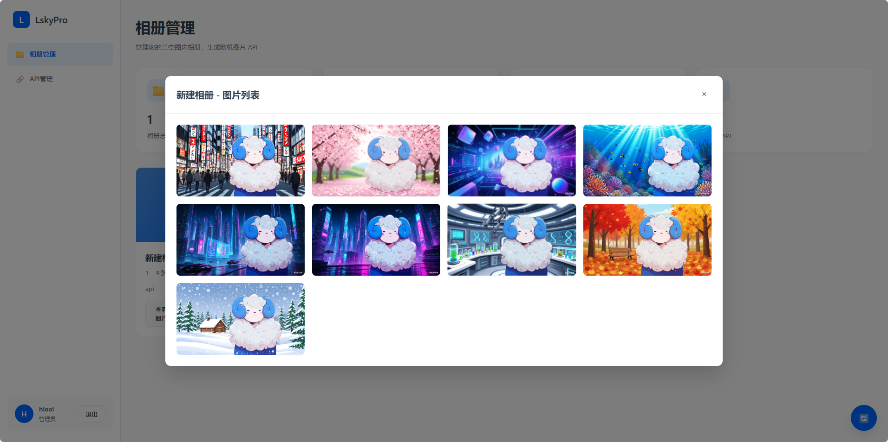
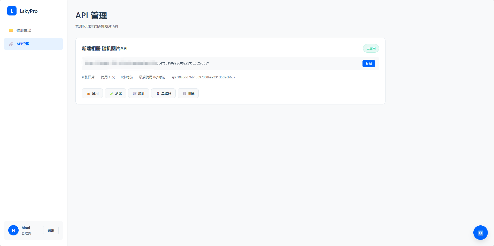

# 兰空图床随机图片API系统

[](https://imgapi.15o.cc/)
[](https://github.com/hloolx/LskyRandImgAPI)
[](LICENSE)

> 🎯 **在线预览**: [https://imgapi.15o.cc/](https://imgapi.15o.cc/)

## 一、项目介绍

### 功能特性
- **兰空图床集成**：通过兰空图床Token登录，自动获取用户相册和图片
- **随机图片API生成**：为每个相册生成独立的随机图片API接口
- **图片管理**：查看相册中的所有图片，支持预览和管理
- **API管理**：创建、查看、启用/禁用、删除API接口
- **安全认证**：基于Session的用户认证系统，Token加密存储

### 技术架构
- **后端**：Node.js + Express + SQLite3
- **前端**：Vue 3 + Vue Router + Vite
- **安全**：AES-256-CBC加密、Session认证、CORS白名单、请求限流

### 使用流程
1. 使用兰空图床地址和Token登录
2. 选择要生成API的相册
3. 创建随机图片API
4. 复制API链接使用

### API接口
- **随机图片**：`GET /api/random/:apiKey` - 返回随机图片（302重定向）
- **登录认证**：`POST /api/auth/login` - 兰空图床Token验证
- **相册管理**：`GET /api/albums` - 获取相册列表
- **API管理**：`POST /api/random-api/create` - 创建随机API

## 项目截图

### 登录界面


### 相册管理


### API管理


*管理您的兰空图床相册，一键生成随机图片API*

## 二、部署方式

### 环境要求
- Node.js 14.0+
- npm 6.0+

### 本地部署

#### 1. 克隆项目
```bash
# 从GitHub克隆
git clone https://github.com/hloolx/LskyRandImgAPI.git
# 或从cnb.cool克隆
git clone https://cnb.cool/hloolx/LskyRandImgAPI.git

cd LskyRandImgAPI
```

#### 2. 安装后端依赖
```bash
npm install
```

#### 3. 安装前端依赖
```bash
cd vue-simple
npm install
```

#### 4. 构建前端
```bash
npm run build
# 构建完成后会生成 dist 目录
cd ..
```

#### 5. 配置环境变量
```bash
# Linux/Mac
cp .env.example .env

# Windows
copy .env.example .env
```

编辑 `.env` 文件，修改以下必填项：
```
PORT=3000                     # 服务端口
ENCRYPT_SECRET=随机32位密钥    # 必须修改！
SESSION_SECRET=随机32位密钥    # 必须修改！
```

#### 6. 启动后端服务
```bash
npm start
```

访问 `http://localhost:3000` 即可使用！

### 生产环境部署（Nginx配置）

当部署到生产服务器时，需要配置Nginx来正确代理前后端服务。

#### Nginx配置要点

在您的Nginx站点配置文件中，需要添加API反向代理配置。以下是需要添加的关键配置：

```nginx
# ===== 必须添加的配置 =====
# API反向代理配置（将前端的/api请求转发到后端服务）
location /api/ {
    proxy_pass http://127.0.0.1:3000;  # 注意：末尾不要加斜杠！
    proxy_http_version 1.1;
    proxy_set_header Upgrade $http_upgrade;
    proxy_set_header Connection 'upgrade';
    proxy_set_header Host $host;
    proxy_cache_bypass $http_upgrade;
    proxy_set_header X-Real-IP $remote_addr;
    proxy_set_header X-Forwarded-For $proxy_add_x_forwarded_for;
    proxy_set_header X-Forwarded-Proto $scheme;
}

# ===== 如果已存在以下配置，无需重复添加 =====
# Vue单页应用路由支持（通常已存在）
location / {
    try_files $uri $uri/ /index.html;
}
```

#### 配置步骤

1. **找到您的Nginx配置文件**
   - 宝塔面板：网站设置 → 配置文件
   - 手动部署：通常在 `/etc/nginx/sites-available/` 或 `/www/server/panel/vhost/nginx/`

2. **添加配置的位置**
   - 在 `server { ... }` 块内
   - 建议放在其他 `location` 配置之前
   - 如果使用宝塔，可以放在 `#REWRITE-END` 注释之后

3. **测试并重启Nginx**
   ```bash
   # 测试配置是否正确
   nginx -t
   
   # 重新加载配置
   nginx -s reload
   # 或
   systemctl reload nginx
   ```

#### 常见错误排查

**问题：前端显示 404 (Not Found) 错误**
- 原因1：未配置API代理
- 解决：添加上述 `location /api/` 配置块
- 原因2：proxy_pass末尾错误地加了斜杠
- 解决：确保 `proxy_pass http://127.0.0.1:3000;` 末尾没有斜杠

**问题：502 Bad Gateway**
- 原因：后端服务未运行或端口不匹配
- 解决：确认后端服务运行中，端口与配置一致

**重要提示：proxy_pass路径规则**
- `proxy_pass http://127.0.0.1:3000;` → 保持原路径 `/api/xxx` → `/api/xxx`
- `proxy_pass http://127.0.0.1:3000/;` → 替换路径 `/api/xxx` → `/xxx`（错误！）

### 长期运行后端服务

由于前端已构建为静态文件（dist目录），后端需要持续运行来提供API服务。

#### 方式一：PM2进程管理器（推荐）
```bash
# 安装PM2
npm install -g pm2

# 启动服务
pm2 start server-secure.js --name "lsky-api"

# 设置开机自启
pm2 startup
pm2 save

# 常用命令
pm2 status        # 查看状态
pm2 logs          # 查看日志  
pm2 restart lsky-api  # 重启服务
pm2 stop lsky-api     # 停止服务
```

#### 方式二：宝塔面板Node项目
如果使用宝塔面板，可以通过以下步骤：
1. 在宝塔面板中创建Node项目
2. 项目目录选择本项目根目录
3. 启动文件选择 `server-secure.js`
4. 端口设置为 `.env` 中配置的端口
5. 点击启动即可保持后端持续运行

#### 方式三：系统服务
```bash
# Linux后台运行
nohup npm start > app.log 2>&1 &

# Windows可使用 node-windows 创建系统服务
npm install -g node-windows
```

### 环境变量配置

| 变量名 | 说明 | 必填 | 示例 |
|--------|------|------|------|
| PORT | 服务端口 | 否 | 3000 |
| ENCRYPT_SECRET | 数据加密密钥 | **是** | 32位随机字符串 |
| SESSION_SECRET | Session密钥 | **是** | 32位随机字符串 |
| CORS_ORIGINS | CORS白名单 | 否 | http://localhost:3000 |

生成安全密钥：
```bash
node -e "console.log(require('crypto').randomBytes(32).toString('hex'))"
```

### 常见问题

**端口被占用？**
```bash
# Windows
netstat -ano | findstr :3000
taskkill /PID 进程ID /F

# Linux/Mac  
lsof -i :3000
kill -9 进程ID
```

**前端页面404？**
```bash
cd vue-simple
npm run build
```

**数据库错误？**
```bash
# Linux/Mac
chmod 666 database.db

# Windows
# 右键文件 -> 属性 -> 安全 -> 给予完全控制权限
```

### 备份与维护
```bash
# 备份数据库
cp database.db database.db.backup

# 更新代码
git pull
npm run setup:build

# 重启服务
# Ctrl+C 停止后重新运行
npm start
```

## 许可证
MIT License

## 联系方式
如有问题或建议，请通过GitHub Issues联系。